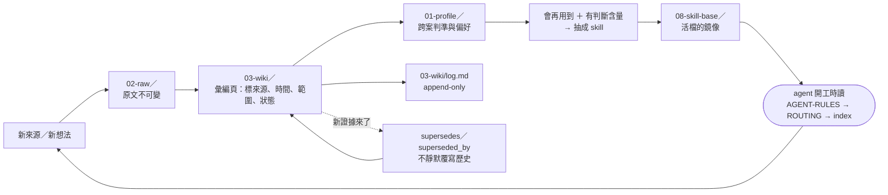

# agent-memory-vault

**給 Claude Code／Codex 使用者的記憶庫起手式**——五分鐘長出一個會代謝的 Markdown 第二大腦、一層 agent 規則、一組 skill 抽取與同步工具，以及一套把「不能外洩」寫成可執行閘門的發布工具。


## 三個命令

```bash
git clone https://github.com/a0359627/agent-memory-vault
python3 agent-memory-vault/tools/bootstrap.py ~/my-vault --owner "你的稱呼" --with-sample
cd ~/my-vault && claude        # 或 codex
```

`--with-sample` 會另外在 `~/my-vault-sample/` 放一個**已經填滿的虛構 vault**，讓你先翻一遍「長好之後長什麼樣」再開始寫自己的。不想要就拿掉這個旗標。

**不想打指令？把這段貼給 Claude Code：**

```text
請讀 docs/quickstart.md，用 tools/bootstrap.py 幫我在 ~/my-vault 建立記憶庫，完成後告訴我第一件該做的事。
```

## 五分鐘後你會有什麼

```text
~/my-vault/
├── AGENT-RULES.md      共用協作規範；AGENTS.md／CLAUDE.md 只負責載入它
├── ROUTING.md          什麼東西該寫到哪：路徑的唯一真相
├── 00-inbox/           還沒分類的今天
├── 01-profile/         你是誰、你的偏好、你的環境、你踩過的坑
├── 02-raw/             不可變的原始來源，只增不改
├── 03-wiki/            彙編頁、索引、open-questions、append-only 的 log
├── 04-projects/ 05-skills-drafts/ 06-reference/ 07-archive/
├── 08-skill-base/      skill 活檔的鏡像（由工具產生，不手寫）
├── 99-secrets-local/   已 gitignored：只記「去哪裡找」，不記值
├── bin/                check_vault.py／skill_sync.py／check-routing.sh，零相依
└── .git/               第一個 commit 已經建好，第一個綠燈也已經亮過

另有 ONBOARDING.md／MIGRATE.md／99-secrets-encrypted/／.obsidian/，第一天用不到可以先不管。
```

## 接下來兩條路

- [**第一次 ingest**](docs/walkthrough-first-ingest.md) — 拿一份真的來源走完一輪代謝：原文進 `02-raw/`、結論進 `03-wiki/`、未決的進 open-questions、log 追加一行。含三種常見錯法。
- [**第一支 skill**](docs/walkthrough-first-skill.md) — 從「這段工作值不值得抽」的自測開始，寫草稿、跑五類測試、登錄、同步到另一個平台、再讓檢查器驗一次。

其餘文件：[快速開始](docs/quickstart.md)、[核心概念](docs/concepts.md)、[閘門怎麼運作](docs/gates.md)、[把自己的 vault 公開出去](docs/publishing-your-vault.md)、[參考文獻](docs/REFERENCES.md)、[常見問題](docs/faq.md)、[八份範本](docs/templates/)。

---

## 核心模型

一句話：**原文不可變、結論可被取代、規則只有一份。**



三層不是三個資料夾的美學問題：**人選的原文**、**agent 寫給人讀的彙編**、**兩邊都必須遵守的規範**，混在一起就沒辦法分辨「這句是誰說的、憑什麼、還算不算數」。

## 三個原則

1. **分清楚來源、推論與人類確認。** 高影響的主張要標來源、時間、適用範圍與權威層級；只有頻率或沉默撐著的，永遠只是候選。（來源：[docs/REFERENCES.md](docs/REFERENCES.md) §A）
2. **一個概念一份 canonical。** 新證據改變舊理解時建立取代關係，不靜默覆寫；歷史紀錄保持原樣，過期的理解在現行入口標明。（來源：[docs/REFERENCES.md](docs/REFERENCES.md) §A）
3. **值不進庫，只記位置。** 金鑰、token、密碼的值永遠留在 gitignored 的本機位置；知識庫只負責記「去哪裡找」。（來源：[docs/REFERENCES.md](docs/REFERENCES.md) §D，規則見 [SECURITY.md](SECURITY.md)）

## 附的 skill

裝法與分工說明見 [`skills/README.md`](skills/README.md)；安裝器預設是預覽，`--apply` 才寫檔，而且**永不覆蓋**你既有的同名 skill。

| skill | 等級 | 一句話 |
|---|---|---|
| [`grill-me`](skills/grill-me/SKILL.md) | 直接可用 | 動手前的對齊拷問：一次一題、每題附建議答案。 |
| [`forge-skill`](skills/forge-skill/SKILL.md) | 直接可用 | 判斷一段工作值不值得抽成 skill，以及怎麼寫成可預測的那種。 |
| [`obsidian-vault`](skills/obsidian-vault/SKILL.md) | 直接可用 | 把新來源與跨案判準沉澱到正確位置，保留出處與適用範圍。 |
| [`project-memory`](skills/project-memory/SKILL.md) | 直接可用 | 單一 repo 的決策、驗收證據、陷阱與下一步。 |
| [`diagnosing-bugs`](skills/diagnosing-bugs/SKILL.md) | 直接可用 | 先建一個「會 red」的緊迴圈，再開始猜原因。 |
| [`verified-research`](skills/verified-research/SKILL.md) | 直接可用 | 會寫進 code 的外部事實追到一手來源。 |
| [`agent-handoff-pack`](skills/agent-handoff-pack/SKILL.md) | 直接可用 | 把 repo 打包成別人的 agent 讀得懂、跑得動的交接包。 |
| [`writing-great-skills`](skills/writing-great-skills/SKILL.md) | 參考用 | 寫 skill 的詞彙與原則（上游英文原文）。 |

另外附一包 [`office-agent-starter-kit/`](office-agent-starter-kit/START-HERE.md)：**這是給 Codex 讀者的教學包**，不是上面那批 skill 的一部分。六支辦公室 skill、五個練習、虛構 fixtures 與自帶驗證器，路徑慣例是 Codex 的 `.agents/skills/`，給「沒有程式背景、想先學會用 agent 做重複工作」的人。Claude Code 使用者不必安裝它，但裡面的 `create_skill.py`／`validate_skill.py` 兩支腳手架仍然好用。

## 這套做法從哪來

三層結構借自 Karpathy 的 LLM Wiki 模型，資料夾的「按可行動性分類」借自 Forte 的 PARA，而「記憶要能被更正、取代、遺忘」則是本 repo 先長出來、後來才發現與 LangChain OpenWiki 殊途同歸。skill 的寫法與抽取門檻借自 Matt Pocock 的 skills 倉庫，但整組只收了三支。每一項借了什麼、**刻意不借什麼、為什麼**，逐條記在 [docs/REFERENCES.md](docs/REFERENCES.md)——那頁也標明哪些來源是本 repo 真的落地實作、哪些只是引用。

## 這個 repo 不是什麼

- **不是筆記 app，也不是 Obsidian 外掛。** Obsidian 在這裡只是可選的唯讀圖譜檢視器；沒裝也能從 `03-wiki/index.md` 一路點完。不需要 MCP、不需要 REST plugin、不需要任何持有 API key 的橋接。
- **不是「裝上去就自動記住你」。** 代謝要靠規則與人的確認；agent 會照 `AGENT-RULES.md` 做，但高影響的結論仍然要你點頭。
- **不是通用 secret scanner。** 這裡的三層掃描是為了「把一個私有知識庫安全地公開出去」設計的，不是你的 CI 安全基礎設施。
- **不是作者的知識庫本體。** 你拿到的是骨架、規則、工具、八支 skill 與一個**虛構**的填滿範例；沒有任何真實的專案頁、review、憑證位置或個人 profile。

## 閘門

`bin/gate.sh --public` 一次跑完：三層發布掃描（L1 secret 樣式／L2 識別字 HMAC／L3 結構與形狀）、第二套獨立掃描器交叉比對、單元測試、skill 同步引擎自測、office kit 驗證器、乾淨 HOME 的端到端 smoke、參考文獻頁一致性、git 歷史與 remote URL 掃描、零 symlink——任一步非 0 即停。每道閘門在做什麼、失敗代表什麼、以及 HMAC 那層已知抓不到什麼，見 [docs/gates.md](docs/gates.md)。

> ⚠️ **掃描器不保證抓到所有機敏資料。** 別稱、暱稱、拼音、縮寫，以及「幾件事湊起來就能反推」的敘述，只有人讀得出來。公開任何東西之前請自己全文讀一遍——這是最後一道、也是唯一真正有效的那道閘門。

## 平台

macOS 與 Linux。Windows 請在 WSL 底下使用：`check-routing.sh` 等腳本是 bash，`skill_sync.py link` 會建立符號連結，兩者在原生 Windows 都不成立。只需要 Python 3.11 以上與 git，**沒有任何第三方套件相依**。

## 授權

本 repo 以 MIT 授權發布，見 [LICENSE](LICENSE)。第三方內容（`mattpocock/skills`，同為 MIT）的逐項對照見 [THIRD-PARTY-NOTICES.md](THIRD-PARTY-NOTICES.md)。

想貢獻請先讀 [CONTRIBUTING.md](CONTRIBUTING.md)——尤其是「任何內容都必須經過去識別化與閘門」那節。發現疑似機敏資料殘留，請照 [SECURITY.md](SECURITY.md) 的方式回報。
