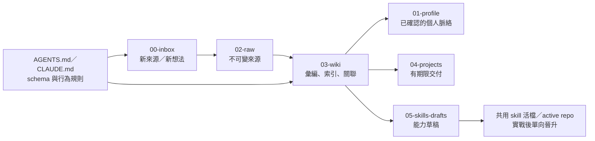

# 核心模型 — 這套記憶庫在賭什麼

這頁是骨架說明。每一節末尾標「出處」，指向 [REFERENCES.md](REFERENCES.md) 的對應節——
那頁寫的是每個設計**從哪借來、刻意不借什麼、為什麼**。

---

## 1. 三層，加上按可行動性分的 PARA

一個筆記資料夾撐不起「給 agent 讀」的記憶庫，因為它分不出「誰說的」與「我怎麼理解的」。
所以最底下是三層：

| 層 | 資料夾 | 誰寫、誰讀、什麼規則 |
|---|---|---|
| **raw（不可變來源）** | `02-raw/` | 人挑進來的原文、逐字稿、抓取版本。**只讀不改**，不在這裡下結論。 |
| **wiki（彙編）** | `03-wiki/` | agent 與人共同維護的摘要、概念、索引與交叉連結。可以被新證據修訂。 |
| **schema（指令層）** | `AGENT-RULES.md` | 這個庫是什麼、慣例是什麼、衝突怎麼處理。`AGENTS.md`／`CLAUDE.md` 只負責載入它。 |

其餘資料夾按**可行動性**分，不按主題分：`00-inbox/`（未分類入口）、`04-projects/`（有期限交付）、
`06-reference/`（快查）、`07-archive/`（非活躍但保留召回）。
沒有獨立的 Areas 層——「持續責任」由 `01-profile/`（個人脈絡）與 `03-wiki/cluster-*.md`（主題星圖）承擔。



注意圖裡沒有任何一條線是「wiki → raw」。原文進來之後就凍結；更正寫在 wiki，不回頭改原文。

> 出處：REFERENCES §A（三層模型、PARA、純 Markdown 圖譜）。

---

## 2. 三個原則

1. **來源與解讀分開。** `02-raw/` 保存原文，`03-wiki/` 才放摘要、推論與交叉連結。
   一個主張若說不出「這是誰說的、什麼時候」，它就還不是知識。
2. **記憶不是只增不減。** 每個高影響主張要能標成 `current`／`superseded`／`contested`／`stale`；
   舊理解用 `supersedes`／`superseded_by` 保留取代關係，**不靜默覆寫**。
3. **AI 推論不是人類決定。** 工作軌跡先是 evidence，agent 的整理先是 candidate；
   缺乏來源、範圍或人類確認時，不得升格成永久偏好或可執行決策。
   **頻率不是同意，沉默不是核准。**

這三條不是價值宣言，是可以違反的規則：違反第 1 條你會得到一份查不到出處的摘要；
違反第 2 條半年後的你會拿三天前的計畫當現行決策；違反第 3 條你的 agent 會把一次趕工的妥協當成你的長期偏好。

> 出處：REFERENCES §A（raw／wiki 分層與記憶代謝）。

---

## 3. 四種 truth，住在四個地方

最常見的誤用是把知識庫當成執行系統的真相來源。它不是。

| 類型 | 住哪裡 | 代表什麼 |
|---|---|---|
| 原始證據 | `02-raw/`、repo、外部系統事件 | 實際出現過的來源；不因彙編方便而改寫 |
| 個人 durable memory | `01-profile/` | 使用者明確確認、跨專案長期成立的偏好、紅線與環境限制 |
| 專案／組織理解 | `03-wiki/` 與各 repo 的 context | 對系統、決策與關係的可讀彙編，可被新證據修訂 |
| 當前任務真相 | 執行系統的 DB、設定與正式 contract | 已核准且可執行的狀態；知識庫不得取代它 |

一句話：**證據紀錄保存發生過什麼；記憶代謝保存我們目前怎麼理解；執行系統保存這次核准要做什麼。**

所以 wiki 式記憶是「理解層」，不是 production control plane：它可以提供證據與候選 patch，
不能直接改執行系統的核准狀態、寄信、部署、權限或付款。

> 出處：REFERENCES §A（代謝規範的四種 truth 與 promotion 判準）。

---

## 4. 一則記憶的一生

```text
來源／工作軌跡
   └─► evidence（有來源、有時間、有 scope）
          └─► candidate（觀察／推論／未知）
                 ├─ 人類明說或權威來源 ──► canonical
                 ├─ 證據不足 ───────────► watchlist／open question
                 └─ 來源互相矛盾 ───────► contested（兩邊都留，不因較新而自動勝出）
canonical 之後還會動：
   更正＝新增有來源的修正，保留舊主張
   取代＝雙向標 supersedes／superseded_by
   過期＝標 stale，不再預設注入未來任務
   遺忘＝從 active memory 移除；必要時只留「何時、誰要求忘記哪個記憶 id」
```

完整欄位（`status`／`source`／`observed_at`／`scope`／`authority`／`confidence`／`revisit_when`）
與 promotion 判準寫在 vault 自己的 [template/03-wiki/memory-metabolism.md](../template/03-wiki/memory-metabolism.md)，
那是會跟著你的 vault 走的規範本體；這裡只解釋它為什麼長這樣。

`open-questions` 只收「若不知道會讓未來協助失準」的未知。普通待辦與程式 bug 留在專案 tracker——
否則它會變成第二個看不完的收件匣。

> 出處：REFERENCES §A（代謝、保留檔 index／log、可更正與可遺忘）。

---

## 5. 兩個入口，一份規範

`AGENTS.md`（Codex）與 `CLAUDE.md`（Claude Code）都只做一件事：指向 `AGENT-RULES.md`。
規範只維護一份，因為兩份規範遲早會分岔，而分岔的那天沒有人會收到通知。

同樣的道理套在路徑上：**`ROUTING.md` 是路徑歸屬的唯一副本**，skill、腳本與平台入口都指向它，
不各自維護一套「東西該放哪」。`bin/check-routing.sh` 就是這條規則的回歸測試。

> 出處：REFERENCES §C（AGENTS.md 分層載入、schema 層定位、managed block 慣例）。

---

## 6. skill：兩條硬線都中才抽，晉升是單向的

值不值得把一段工作抽成 skill，只有兩個判準，**兩個都中**才抽：

1. **會再用到**（不是「這次很麻煩」，是「下個月還會做一次」）；
2. **有判斷含量**（有取捨、有判準、有容易踩的坑；純粹的指令序列寫成腳本就好）。

路徑是單向的：`05-skills-drafts/<name>/` 草擬與實跑 → 穩定後晉升到共用活檔位置或 active repo →
**刪掉草稿**，避免兩份分歧全文 → 在 `03-wiki/log.md` 追加一則 `promote`。
skill 的靈魂是判準不是步驟；`03-wiki/skill-*.md` 只是導航卡，不複製整份 skill。

實際怎麼走見 [walkthrough-first-skill.md](walkthrough-first-skill.md) 與 [skills-and-sync.md](skills-and-sync.md)。

> 出處：REFERENCES §B（skill 格式規格、抽取門檻與晉升路徑）。

---

## 7. 六條工程紀律

這六條不綁工具，也不綁領域。它們是這個庫裡最貴的東西——每一條都是先付過代價才寫下來的。

1. **依任務對齊，不要在方向還糊的時候動手。**
   能查到的事實自己查；已有授權的可逆工作持續做完。只有「關鍵方向仍模糊」或使用者明說要對齊時，
   才停下來一次一題問清楚（這就是 `grill-me` 的用途）。

2. **修 bug 先建立可觀測證據。**
   先做出一個**會 red 的回饋迴圈**，再開始猜原因。可以安全重現就把迴圈固定下來；
   只有碰 production 才重現得了的，先讀 log 或在副本上重現，不要在正式環境試。

3. **skill 維護依平台選用主流程。**
   用當前平台的 skill 建立／驗證工具管格式，需要時再讀寫作原則。
   以結果與可驗證判準決定步驟，不強迫每個任務走同一套流程——那是儀式，不是紀律。

4. **「乾跑」必須是零副作用，否則不要叫乾跑。**
   會寫入外部系統的東西——寫進下游、建立紀錄、觸發外部回呼——都不叫乾跑，
   叫「少做一步的正式執行」。要嘛做成真的唯讀，要嘛換個誠實的名字。
   **因為你叫它乾跑，人就會拿它去碰 production。**

5. **多租戶化時，逐一稽核每個「不帶參數」的預設語意——它會靜默反轉。**
   單租戶時「不帶 X」＝「那唯一一個」；加了租戶維度以後，同一支端點變成「全部」，
   而下游**不會報錯**，只會開始吃到不屬於它的資料。
   同理還有「設定繼承全域預設」：危險欄位（外部目的地、系統位址）要 fail-closed，
   方便性的繼承（逾時、模型名稱）留著沒關係。

6. **把不變條件寫成可執行的 gate，不要寫成檢查清單。**
   清單會被跳過，gate 不會。同一個道理延伸出兩條：
   **改 production 之前先在真實資料的副本上跑一遍**；
   **回報要分層**——實作、測試、提交、合併、部署與人工接受是六件事，
   API 200、成功 render 或測試通過只能證明對應的那一層。

第 1–3 條吸收自外部的 skill 工程方法，第 4–6 條是這個庫自己長出來的。
把它們變成可執行檢查的做法見 [gates.md](gates.md)。

> 出處：REFERENCES §B（外部方法與取捨）、§D（掃描與安全閘門）。

---

## 8. 值不進庫，只記位置

金鑰、token、密碼的**值**不進版本庫、不進這個庫、也不進任何 agent 的回應文字。
需要提到某把 key 時只寫「名稱 ＋ 用途 ＋ 放在哪個檔案路徑」。

要讓秘密隨 repo 走，就先加密：密文可以進 git，私鑰單獨手搬、永不入庫。
明文一旦 commit 就是全歷史一次洩漏，事後改 public、加協作者或 token 外流都救不回來。

規則本體在 [template/06-reference/secrets-hygiene.md](../template/06-reference/secrets-hygiene.md)，
操作見 [secrets-with-age.md](secrets-with-age.md)。

> 出處：REFERENCES §D（age、gitignore 樣板、secret 掃描）。
