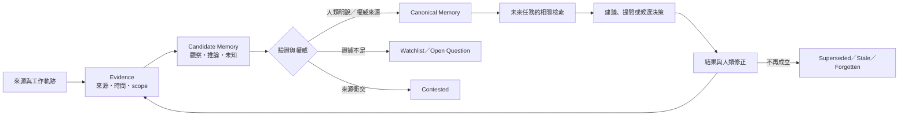

# Memory Metabolism — 讓第二大腦隨人與工作成長

## 一句話

本 vault 不只是保存資料，而是把新證據轉成**有來源、有時間、有範圍、可更正與可遺忘**的工作記憶。
這套方法受 [OpenWiki](https://github.com/langchain-ai/openwiki) 啟發，但本 vault 仍是唯一
canonical 個人第二大腦，不另外建立競爭的 Wiki truth。

## 為什麼需要代謝

只追加文件會產生三種污染：舊計畫仍像現行決策、單次行為被誤認成永久偏好、不同 agent 各自保存一份
互相分歧的記憶。記憶的價值不在「存得多」，而在未來的 agent 能回答：

1. 這件事從哪裡知道？
2. 它是觀察、推論，還是人類明確確認？
3. 它在什麼人、角色、專案與時間範圍內成立？
4. 是否已有新證據取代或反駁？
5. 這次是否仍值得帶入，還是應重新詢問？

## 記憶循環

## 四種不同的 truth

| 類型 | 住哪裡 | 代表什麼 |
|---|---|---|
| 原始證據 | `02-raw/`、repo、外部系統 event | 實際出現過的來源；不可因彙編方便而改寫 |
| 個人 durable memory | `01-profile/` | 使用者明確確認、跨專案長期成立的偏好、紅線與環境限制 |
| 組織／專案理解 | `03-wiki/` 與各 repo context | 對系統、決策、事故與關係的可讀彙編，可被新證據修訂 |
| 當前任務真相 | 執行系統的 DB 與正式 contract | 已核准且可執行的狀態；Wiki 不得取代它 |

Wiki 式記憶是「理解層」，不是 production control plane。它可以提供證據與候選 patch，不能直接修改
執行系統的核准狀態、寄信、部署、權限、付款或其他外部狀態。

## 每條高影響記憶需要的欄位

不強迫所有頁面使用相同表格，但高影響主張至少要能看出：

- `status`：`current`／`superseded`／`contested`／`watchlist`／`stale`；
- `source`：檔案、commit、事件或人類明確說法；
- `observed_at`：何時取得；
- `scope`：個人、角色、團隊、專案或單次 case；
- `authority`：`user-confirmed`／`authoritative-source`／`observed-pattern`／`inferred`；
- `confidence`：`confirmed`／`source-backed`／`watchlist`，不得用假精確百分比；
- `revisit_when`：什麼條件改變時要重問；
- `supersedes`／`superseded_by`：若有取代關係，指向前後版本。

## Promotion：什麼可以升成個人記憶

可直接進 `01-profile/`：

- 使用者明確說「以後都這樣」或清楚確認的跨專案偏好；
- 多次、跨情境出現且由使用者確認的合作方式；
- 安全、資料與授權紅線；
- 換 session、工具或專案仍必須知道的環境限制。

只能先當候選／watchlist：

- AI 從點擊、回覆速度、使用頻率推測的喜好；
- 單一專案或單次趕工的選擇；
- 團隊行為推回某一個人的能力、態度或績效；
- 沒有來源或只有模型摘要的主張。

**頻率不是同意，沉默不是核准。** 工作軌跡可以幫 AI 助理少問重複問題，但高影響決策仍要讓人確認。

## 更正、取代、過期與遺忘

- **更正**：新增一筆有來源的修正，保留舊主張及其當時情境，不覆寫歷史。
- **取代**：新決策明確替代舊決策時，雙向標 `supersedes`／`superseded_by`。
- **爭議**：可信來源互相矛盾時保留兩邊，標 `contested`；不能只因較新就自動勝出。
- **過期**：長期未重現、專案已結束或條件已變，標 `stale`，不再預設注入未來任務。
- **遺忘**：使用者要求刪除個人推論或私人記憶時，從 active memory 移除；若稽核需要保留刪除事件，只記
  「何時、誰要求忘記哪個記憶 ID」，不保留被要求刪除的敏感內容。

## Open Questions

[[open-questions]] 只追蹤「若不知道會讓未來協助失準」的問題，例如：某項偏好只適用單一客戶還是所有
對外內容、兩份文件對同一個系統的上線狀態描述互相矛盾。普通產品 TODO、程式 bug 與一般待辦應留在專案 tracker。

每次記憶維護開始時看 Active；結束時把已解問題移到 Answered，把條件消失的移到 Stale。不要把每一個弱訊號
都變成問題，否則只會製造新的注意力債務。

## 從工作系統抽記憶的三行通則

想從你每天在用的工作系統（工單、信件、專案板）長出記憶時，先守住三件事：

- **只讀**：觀察者不回寫來源系統，不改它的規則、狀態或路由。
- **去識別、分 scope**：個人記憶、角色記憶、團隊記憶與組織政策分開存、分開授權；不以活動量評分人。
- **候選不是記憶**：抽出來的東西一律先是 candidate，經人類確認、更正或要求忘記之後才進 canonical。

## 寫入檢查

1. 先讀 `ROUTING.md`，確認 canonical 位置。
2. 找現有 canonical 頁，不為同一概念新增第二份真相。
3. 保留來源、時間、scope 與 authority；敏感原文最小化。
4. 判斷是 current、候選、爭議、取代還是過期。
5. 個人推論先進 watchlist／open question，不直接進 `01-profile/`。
6. 更新受影響的 canonical 頁、[[open-questions]]、[[index]] 與 [[log]]。
7. 若沒有新增 durable knowledge，允許 no-op。

## 與執行系統的關係

執行系統管理可執行任務、授權、產物與證據；本頁管理跨任務的理解如何形成與修正。簡化成一句話：

> 證據紀錄保存發生過什麼；記憶代謝保存我們目前怎麼理解；執行系統保存這次核准要做什麼。

回 [[index]] · [[open-questions]]
